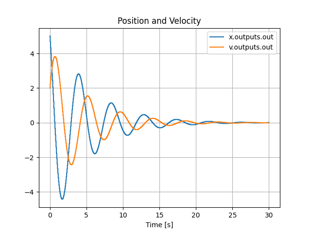

# pySimBlocks

A deterministic block-diagram simulation framework for discrete-time modeling, co-simulation and research prototyping in Python.

pySimBlocks allows you to build, configure, and execute discrete-time systems using either:

- A pure Python API
- A graphical editor (PySide6)
- YAML project configuration
- Optional SOFA and hardware integration

## Features

- Block-based modeling (Simulink-like)
- Deterministic discrete-time simulation engine
- PySide6 graphical editor
- YAML-based project serialization
- Exportable Python runner (`run.py`)
- Extensible block architecture

## Installation

### From GitHub

Install directly from GitHub using pip:
```
pip install git+https://github.com/AlessandriniAntoine/pySimBlocks
```

### Locally

Clone the repository and install locally:
```
git clone https://github.com/AlessandriniAntoine/pySimBlocks.git
cd pySimBlocks
pip install .
```

## First Steps

### Quick Example

The following example models a damped harmonic oscillator:

$$ \ddot{x} +0.5 \dot{x} +2 x = 0 $$

The continuous-time equation is implemented using explicit forward Euler discretization through discrete integrator blocks with a fixed time step.

The system is assembled explicitly from discrete operators.

```python
from pySimBlocks import Model, Simulator, SimulationConfig, PlotConfig
from pySimBlocks.blocks.operators import Gain, Sum, DiscreteIntegrator
from pySimBlocks.project.plot_from_config import plot_from_config

# 1. Create the blocks
I1 = DiscreteIntegrator("x", initial_state=5)
I2 = DiscreteIntegrator("v", initial_state=2.)
A1 = Gain(name="damping", gain=0.5)
A2 = Gain(name="stiffness", gain=2)
S = Sum(name="sum", signs="--")

# 2. Build the model
model = Model("Example")
for block in [I1, I2, A1, A2, S]:
    model.add_block(block)

model.connect("x", "out", "v", "in")
model.connect("x", "out", "damping", "in")
model.connect("v", "out", "stiffness", "in")
model.connect("damping", "out", "sum", "in1")
model.connect("stiffness", "out", "sum", "in2")
model.connect("sum", "out", "x", "in")

# 3. Create the simulator
sim_cfg = SimulationConfig(dt=0.05, T=30.)
sim = Simulator(model, sim_cfg)

# 4. Run the simulation
logs = sim.run(logging=[
        "x.outputs.out",
        "v.outputs.out",
    ]
)

# 5. Plot the results
plot_cfg = PlotConfig([
    {"title": "Position and Velocity",
     "signals": ["x.outputs.out", "v.outputs.out"],},
    ])
plot_from_config(logs, plot_cfg)
```

The simulated position and velocity exhibit the expected damped oscillatory behavior.



### Graphical Editor

To open the graphical editor, run:
```bash
pysimblocks
```

### Tutorials

See the [Getting Started Guide](./docs/User_Guide/getting_started.md) for
tutorials on building your first simulation with pySimBlocks.

### Examples

A collection of basic and advanced examples is available in the
[examples](./examples) directory, including:

- Control system demonstrations
- SOFA-based simulations
- Hardware and real-time use cases
- Comparisons with external tools

See [examples/README.md](./examples/README.md) for an overview.

## Information

### License

pySimBlocks is LGPL.

LGPL refers to the GNU Lesser General Public License as published by the Free Software
Foundation; either version 3.0 of the License, or (at your option) any later 
version.

---
© 2026 Université de Lille & INRIA – Licensed under LGPL-3.0-or-later
