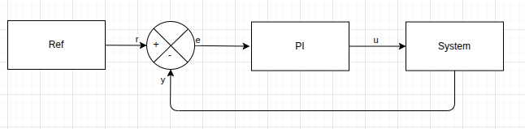
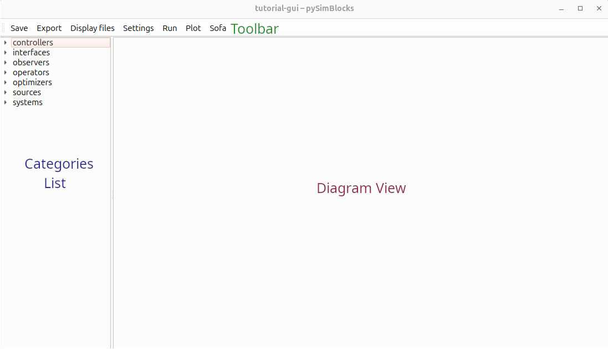
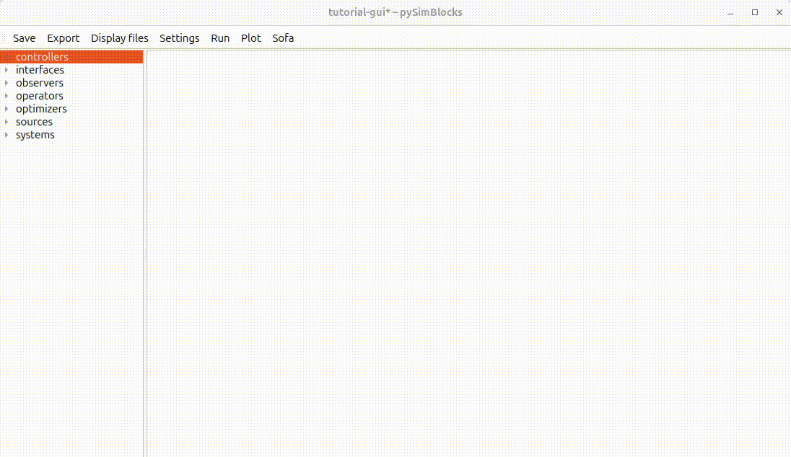
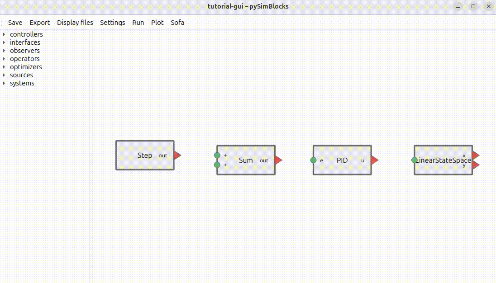
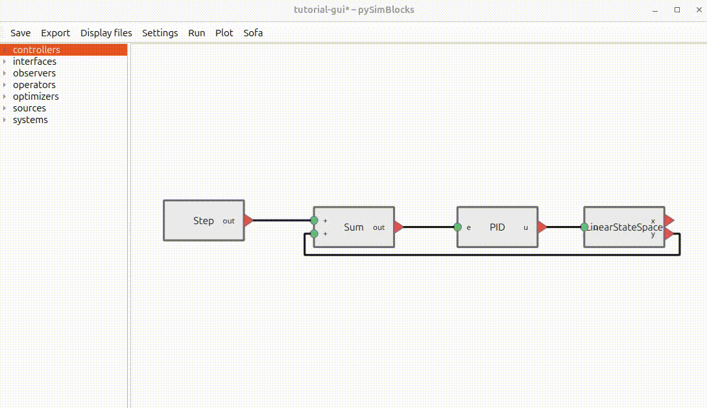
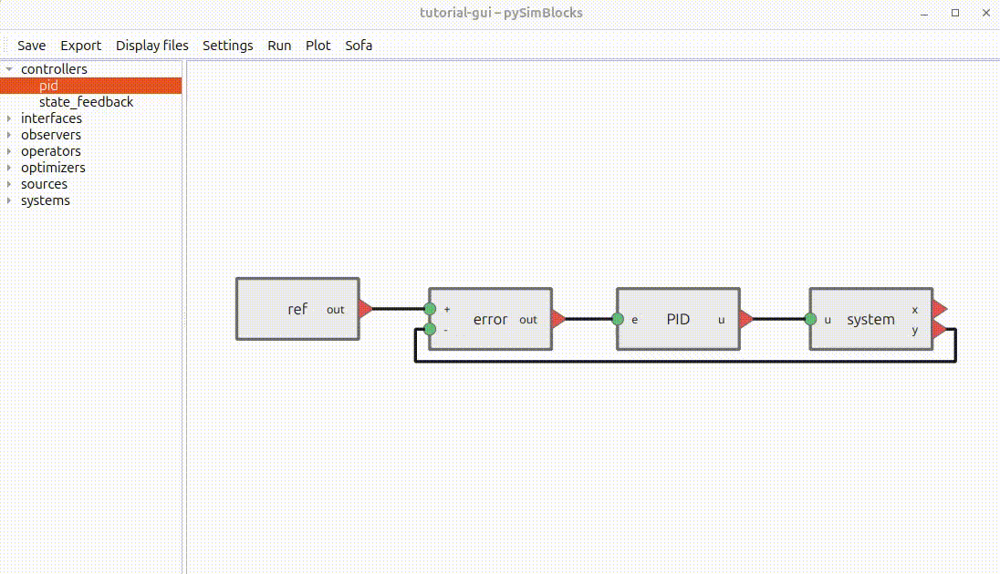
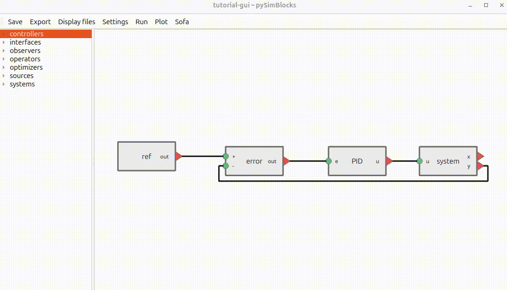

# Tutorial 2 — Building a Model with the GUI

## 1. Overview

We rebuild the same closed-loop system as in [Tutorial 1](./tutorial_1_python.md), but using the graphical editor.

### 1.1 Goals 

The objective is to:
- Add blocks visually
- Configure their parameters
- Connect signals
- Run the simulation
- Export the project

By the end of this tutorial, you will be able to build and simulate your own block-based model with the GUI.

### 1.2 System Reminder

We build a simple closed-loop control system composed of three elements: 
- a step reference, 
- a PI controller, 
- a first-order discrete-time linear plant.



## 2. Step-by-Step Construction

### 2.1 Create a New Project 

Create a new project folder and start the GUI:
```bash
$ mkdir tutorial-gui
$ cd tutorial-gui
$ pysimblocks
```
The main window opens, with the `Toolbar` at the top, the `Blocks List` on the left, and the `Diagram View` on the right.


### 2.2 Add the Blocks 

Add the required blocks to the diagram.
1. Double-click a category in the `Blocks List` to expand it.
2. Drag the selected block into the `Diagram View` 
3. Repeat this for all required blocks and arrange them in the `Diagram View`. 



**Tips:** 
- Once you have all your blocks, if you click anywhere in the `Diagram View`, you can use `space` to center the view on all blocks.
- To rotate a block, select it and press `Ctrl+R`. 

### 2.3 Connect the Blocks

In a block, input ports are represented by a circle and output ports by a triangle.

To connect two blocks: Select the first port (input or output) and drag the connection to the target port.

When dragging the cable, a dashed line appears between the starting port and the cursor. The line becomes solid once the connection is valid.



⚠️ The two ports must be of different types (input to output). 

**Tips:** You can move a connection by selecting the line and moving your mouse. However, if a connected block moves, the connection is recomputed.

### 2.4 Configure the Parameters 

Configure the block and simulation parameters.

#### 2.4.a For the Blocks 

Open the block dialog by double-clicking the block.

The dialog displays all available block parameters. Some parameters are optional, while others accept only predefined values. Some parameters are populated with default values.

Modify the following parameters:
| Block | Parameter | Value |
| --- | --- | --- |
| LinearStateSpace | A | 0.9 |
| LinearStateSpace | B | 0.5 |
| LinearStateSpace | C | 1.0 |
| LinearStateSpace | x0 | 0. |
| PID | controller | PI |
| PID | Kp | 0.5 |
| PID | Ki | 2. |
| Sum | signs | +- |

Renaming a block updates its label in the `Diagram View`. In [Tutorial 1](./tutorial_1_python.md), the blocks were named `ref`, `error`, `pid`, and `system`.

All required parameters must be defined before running the simulation.



**Tips:** 
- Scalars are represented as `(1,1)` arrays. But you can create matrix or vector by defining `[[0.5], [0.3]]`  which will be set to a `(2,1)` numpy array.
- Use the Help button for a detailed description of the block.

#### 2.4.b For the Simulation

Next, configure the simulation settings:
- Sample time: 0.01 s
- Duration: 5 s
- Signals to log: system y, pid u, and ref output

Click the `Settings` button in the `Toolbar`. A dialog opens with multiple panels. One is for the simulation.

Custom plots can be defined in the `Plots` panel for quick access after the simulation You must define:
- the title 
- the signals 


⚠️ Click `Apply` before switching panels, otherwise the changes will not be saved.  
Click on `ok` to close.

### 2.5 Run the Simulation and Visualize the Results

Once all parameters are configured, run the simulation using the `Run` button in the `Toolbar`.

Click the `Plot` button in the `Toolbar` to visualize the results. A dialog opens where you can either:
- Plot selected logged signals in a single graph.
- Open your predefined plots. 


Under the hood, the GUI generates the same `Model` structure used in [Tutorial 1](./tutorial_1_python.md). The execution engine remains identical.

## 3. Generate Project Files 

### Saving

Saving the project using the `Save` button in the `Toolbar` creates three YAML files in the current folder:
- `model.yaml` — defines the blocks and their connections
- `parameters.yaml` — contains block parameters, simulation settings, and plot definitions
- `layout.yaml` — stores the graphical layout of blocks and connections in the Diagram View

Together, these files fully describe the model structure and its configuration. They can be used to reload the project in the GUI or to run the simulation programmatically using Python.

### Exporting a Python Runner

The `Export` button in the `Toolbar` generates a `run.py` file.

This script loads the YAML configuration (model and parameters) and builds the corresponding `Model` and `Simulator` objects programmatically.  
It allows the project to be executed directly from the command line:

```bash
python run.py
```

The export mechanism bridges the GUI and the Python API, ensuring that a visually designed model can be reproduced and executed in a script-based workflow.

## 4. Comparison with Python Version 

The system built in this tutorial is identical to the one created manually in [Tutorial 1](./tutorial_1_python.md).

In the Python version, blocks and connections are defined explicitly in code:

- Blocks are instantiated programmatically
- Connections are created using `model.connect(...)`
- The `Simulator` is constructed directly

In the GUI version:

- The block diagram is created visually
- The configuration is saved as YAML files
- The `Export` function generates a `run.py` script that builds the same `Model` structure

In both cases, the execution engine is strictly the same.

## 5. Try It Yourself

Experiment with the model to better understand the GUI workflow:

- Modify the controller gains (`Kp`, `Ki`) and observe the effect on the response.
- Change the system dynamics (`A`, `B`) and analyze stability.
- Adjust the sample time or simulation duration.
- Create additional custom plots in the `Plots` panel.
- Rename blocks and reorganize the diagram layout.

After modifying the model, save the project and export a new `run.py` file.  
Run it from the command line to verify that the exported script reproduces the same behavior.

This tutorial demonstrates how to build and execute a model visually.  
The next tutorials extend this approach to SOFA integration and real-time execution.


